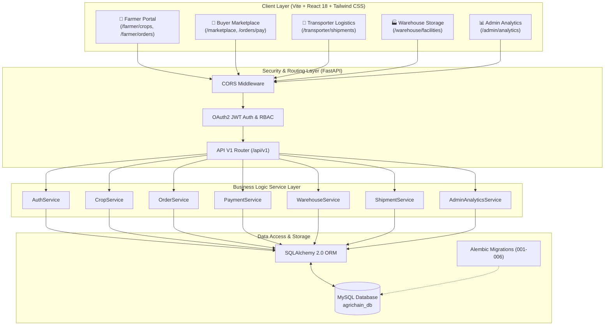

# 🌾 AgriChain — Full-Stack Agricultural Supply Chain Management Platform
## Comprehensive Project Documentation & Technical Architecture Report

---

## 1. Project Overview & Business Value

**AgriChain** is a production-grade, modular, full-stack Agricultural Supply Chain Management Platform designed to eliminate intermediaries, reduce post-harvest losses, ensure price transparency, and streamline logistics between agricultural producers and commercial buyers.

### Key Objectives
- **Direct Marketplace**: Connect farmers directly with institutional and retail buyers, eliminating traditional middleman markups.
- **Logistics Milestone Tracking**: Provide end-to-end visibility for harvest dispatches, driver/vehicle allocations, transit milestones, and cold storage handoffs.
- **Role-Tailored Dashboards**: Empower 5 distinct ecosystem roles (**Farmer**, **Buyer**, **Transporter**, **Warehouse Manager**, **Admin**) with specialized user interfaces and REST API controls.
- **Automated Quality & Order Lifecycle**: Enforce strict state machines for order requests, payment confirmation, cold storage reservation, and dispatch fulfillment.

---

## 2. Complete Technical Stack

| Domain | Technology / Library | Version / Details | Purpose |
| :--- | :--- | :--- | :--- |
| **Backend Framework** | **Python / FastAPI** | `3.12+` / `FastAPI 0.110+` | High-performance asynchronous REST API framework with Pydantic v2 validation. |
| **Database ORM** | **SQLAlchemy 2.0** | `2.0+` | Modern type-safe Object Relational Mapper for MySQL database models and queries. |
| **Database Engine** | **MySQL Server** | `8.0+` (Port 3306) | Relational database management system housing transactional data. |
| **DB Migrations** | **Alembic** | `1.13+` | Version-controlled database schema migrations (`001` through `006`). |
| **DB Driver** | **PyMySQL** | `1.1+` | Pure-Python MySQL client driver. |
| **Security & Auth** | **JWT / Bcrypt / Passlib** | `python-jose`, `bcrypt` | Secure password hashing (72-byte truncated bcrypt) and OAuth2 Bearer JWT tokens. |
| **Frontend UI** | **React 18** | `18.2+` | Component-based single page web application framework. |
| **Build Tooling** | **Vite** | `5.4+` | Fast frontend dev server and production asset bundler. |
| **Styling & Icons** | **Tailwind CSS / Lucide React** | `3.4+` / `Lucide 0.344+` | Utility-first responsive CSS styling and modern vector icons. |
| **HTTP Client** | **Axios Client** | `1.6+` | Intercepted HTTP client managing JWT authorization headers and error handling. |
| **Data Viz** | **Recharts** | `2.12+` | Interactive charts for Admin analytics (Order Volume, Revenue Trends, Role Metrics). |
| **Automated Testing** | **Pytest** | `9.1+` | Automated unit & integration testing framework (`41/41 passed 100%`). |

---

## 3. System Architecture Diagram

The system follows a clean modular multi-tier architecture separating presentation, API routing, business services, data access, and database storage.



---

## 4. Work Accomplished & Completed Modules

### Phase 1: Foundation & Infrastructure
- Created project directory structure, FastAPI backend scaffolding, Alembic configuration, and Vite React frontend setup.
- Implemented global CORS middleware, structured logging, health check endpoint (`/api/v1/health`), and custom exception handlers.

### Phase 2: User Authentication & Role-Based Access Control (RBAC)
- Built user registration, login, JWT token generation (`create_access_token`), and password hashing (`get_password_hash`).
- Enforced strict role-based access decorators (`require_roles([UserRole.FARMER])`) protecting REST API endpoints.
- Created `AuthContext.jsx` on frontend managing global state, local storage persistence, and automatic authorization header injection via Axios interceptors.

### Phase 3: Farmer Crop Yield Management
- Implemented Crop ORM model with fields: `name`, `category` (GRAINS, FRUITS, VEGETABLES, SPICES, OTHER), `quantity`, `unit`, `expected_price`, `quality` (GRADE_A, PREMIUM, STANDARD), `harvest_date`, `location`, `status`.
- Built farmer endpoints: Add Crop (`POST /api/v1/crops`), Edit Crop (`PATCH /api/v1/crops/{id}`), Delete Crop (`DELETE /api/v1/crops/{id}`), and List My Crops (`GET /api/v1/crops/mine`).
- Created React pages: `MyCropsPage.jsx`, `AddCropPage.jsx`, `EditCropPage.jsx`.

### Phase 4: Buyer Marketplace & Crop Browsing
- Built public/buyer marketplace endpoints (`GET /api/v1/crops/available`) supporting multi-field filtering (category, location, quality, price range), search, sorting, and pagination.
- Built crop detail lookup (`GET /api/v1/crops/{id}`).
- Created React pages: `BuyerMarketplacePage.jsx`, `CropDetailsPage.jsx`.

### Phase 5: Order Lifecycle & Management
- Implemented Order ORM model with status state machine: `PENDING` -> `ACCEPTED` / `REJECTED` -> `PAID` -> `READY_FOR_PICKUP` -> `IN_TRANSIT` -> `DELIVERED` -> `COMPLETED`.
- Built buyer order placement (`POST /api/v1/orders`), buyer order listing (`GET /api/v1/orders/mine`), farmer incoming order management (`GET /api/v1/orders/incoming`), and order acceptance/rejection (`PATCH /api/v1/orders/{id}/status`).
- Created React pages: `PlaceOrderPage.jsx`, `MyOrdersPage.jsx`, `FarmerIncomingOrdersPage.jsx`.

### Phase 6: Mock Payment Gateway Integration
- Implemented Payment ORM model with methods: `MOCK_BANK`, `MOCK_CARD`, `MOCK_UPI`, `MOCK_WALLET`.
- Built mock payment processing endpoint (`POST /api/v1/payments/process`). Upon payment success, order status automatically advances from `PAYMENT_PENDING` to `PAID`.
- Created React page: `PaymentCheckoutPage.jsx`.

### Phase 7: Cold Storage Warehouse Management
- Implemented Warehouse and StorageBooking ORM models.
- Built warehouse manager endpoints: List/Add Facilities (`GET/POST /api/v1/warehouses`), Allocate Storage (`POST /api/v1/warehouses/allocate`), and Release Storage (`PATCH /api/v1/warehouses/bookings/{id}/release`).
- Created React pages: `WarehouseManagementPage.jsx`, `AddWarehousePage.jsx`.

### Phase 8: Transporter Logistics & Dispatch Tracking
- Implemented Shipment ORM model with status flow: `ASSIGNED` -> `PICKED_UP` -> `IN_TRANSIT` -> `DELIVERED`.
- Built transporter endpoints: Assign Shipment (`POST /api/v1/shipments/assign`), Update Tracking (`PATCH /api/v1/shipments/{id}/status`), and List Transporter Shipments (`GET /api/v1/shipments/mine`).
- Created React pages: `TransporterDashboardPage.jsx`, `AssignShipmentPage.jsx`.

### Phase 9: Admin Analytics & Platform Notifications
- Implemented Admin Analytics endpoint (`GET /api/v1/admin/analytics`) aggregating total users, role breakdown, total crop listings, order volumes, gross platform revenue, and shipment completion rates.
- Built Notification system for real-time order and shipment alerts (`GET/PATCH /api/v1/notifications`).
- Created React page: `AdminAnalyticsDashboardPage.jsx` and `NotificationBell.jsx` component.

### User Interface & Interactivity Upgrade
- Added **Instant 1-Click Interactive Demo Login** bar on `LandingPage.jsx` for 5 pre-seeded accounts.
- Added live crop marketplace feed with category filters and search bar directly on the home page.
- Created automated 1-click launcher script **`start_agrichain.bat`**.

---

## 5. Database Schema Structure

```sql
-- 1. Users Table
CREATE TABLE users (
    id INT AUTO_INCREMENT PRIMARY KEY,
    full_name VARCHAR(100) NOT NULL,
    email VARCHAR(255) UNIQUE NOT NULL,
    password_hash VARCHAR(255) NOT NULL,
    role ENUM('FARMER', 'BUYER', 'TRANSPORTER', 'WAREHOUSE_MANAGER', 'ADMIN') NOT NULL,
    is_active BOOLEAN DEFAULT TRUE NOT NULL,
    created_at DATETIME DEFAULT CURRENT_TIMESTAMP NOT NULL,
    updated_at DATETIME ON UPDATE CURRENT_TIMESTAMP
);

-- 2. Crops Table
CREATE TABLE crops (
    id INT AUTO_INCREMENT PRIMARY KEY,
    farmer_id INT NOT NULL,
    name VARCHAR(100) NOT NULL,
    category ENUM('GRAINS', 'VEGETABLES', 'FRUITS', 'PULSES', 'SPICES', 'OTHER') NOT NULL,
    description TEXT,
    quantity FLOAT NOT NULL,
    unit VARCHAR(20) DEFAULT 'kg' NOT NULL,
    expected_price FLOAT NOT NULL,
    quality ENUM('GRADE_A', 'GRADE_B', 'PREMIUM', 'STANDARD') NOT NULL,
    harvest_date DATE NOT NULL,
    location VARCHAR(150) NOT NULL,
    status ENUM('AVAILABLE', 'RESERVED', 'SOLD', 'INACTIVE') DEFAULT 'AVAILABLE' NOT NULL,
    created_at DATETIME DEFAULT CURRENT_TIMESTAMP NOT NULL,
    FOREIGN KEY (farmer_id) REFERENCES users(id) ON DELETE CASCADE
);

-- 3. Orders Table
CREATE TABLE orders (
    id INT AUTO_INCREMENT PRIMARY KEY,
    buyer_id INT NOT NULL,
    farmer_id INT NOT NULL,
    crop_id INT NOT NULL,
    quantity FLOAT NOT NULL,
    unit_price FLOAT NOT NULL,
    total_amount FLOAT NOT NULL,
    status ENUM('PENDING', 'ACCEPTED', 'REJECTED', 'PAYMENT_PENDING', 'PAID', 'STORAGE_PENDING', 'READY_FOR_PICKUP', 'IN_TRANSIT', 'DELIVERED', 'COMPLETED', 'CANCELLED') DEFAULT 'PENDING' NOT NULL,
    delivery_address TEXT NOT NULL,
    notes TEXT,
    created_at DATETIME DEFAULT CURRENT_TIMESTAMP NOT NULL,
    FOREIGN KEY (buyer_id) REFERENCES users(id) ON DELETE CASCADE,
    FOREIGN KEY (farmer_id) REFERENCES users(id) ON DELETE CASCADE,
    FOREIGN KEY (crop_id) REFERENCES crops(id) ON DELETE CASCADE
);

-- 4. Payments Table
CREATE TABLE payments (
    id INT AUTO_INCREMENT PRIMARY KEY,
    order_id INT UNIQUE NOT NULL,
    buyer_id INT NOT NULL,
    amount FLOAT NOT NULL,
    payment_method ENUM('MOCK_BANK', 'MOCK_CARD', 'MOCK_UPI', 'MOCK_WALLET') DEFAULT 'MOCK_CARD' NOT NULL,
    payment_status ENUM('INITIATED', 'SUCCESS', 'FAILED', 'REFUNDED') DEFAULT 'SUCCESS' NOT NULL,
    transaction_reference VARCHAR(100) UNIQUE NOT NULL,
    paid_at DATETIME,
    created_at DATETIME DEFAULT CURRENT_TIMESTAMP NOT NULL,
    FOREIGN KEY (order_id) REFERENCES orders(id) ON DELETE CASCADE,
    FOREIGN KEY (buyer_id) REFERENCES users(id) ON DELETE CASCADE
);

-- 5. Warehouses Table
CREATE TABLE warehouses (
    id INT AUTO_INCREMENT PRIMARY KEY,
    manager_id INT,
    name VARCHAR(150) NOT NULL,
    location VARCHAR(255) NOT NULL,
    total_capacity_tons FLOAT NOT NULL,
    available_capacity_tons FLOAT NOT NULL,
    is_active BOOLEAN DEFAULT TRUE NOT NULL,
    created_at DATETIME DEFAULT CURRENT_TIMESTAMP NOT NULL,
    FOREIGN KEY (manager_id) REFERENCES users(id) ON DELETE SET NULL
);

-- 6. Storage Bookings Table
CREATE TABLE storage_bookings (
    id INT AUTO_INCREMENT PRIMARY KEY,
    order_id INT UNIQUE NOT NULL,
    warehouse_id INT NOT NULL,
    allocated_by_id INT NOT NULL,
    quantity_stored FLOAT NOT NULL,
    storage_status ENUM('RESERVED', 'STORED', 'RELEASED_FOR_DISPATCH') DEFAULT 'RESERVED' NOT NULL,
    entry_date DATETIME,
    release_date DATETIME,
    created_at DATETIME DEFAULT CURRENT_TIMESTAMP NOT NULL,
    FOREIGN KEY (order_id) REFERENCES orders(id) ON DELETE CASCADE,
    FOREIGN KEY (warehouse_id) REFERENCES warehouses(id) ON DELETE CASCADE,
    FOREIGN KEY (allocated_by_id) REFERENCES users(id) ON DELETE CASCADE
);

-- 7. Shipments Table
CREATE TABLE shipments (
    id INT AUTO_INCREMENT PRIMARY KEY,
    order_id INT UNIQUE NOT NULL,
    transporter_id INT NOT NULL,
    warehouse_id INT,
    vehicle_number VARCHAR(50) NOT NULL,
    driver_name VARCHAR(100) NOT NULL,
    driver_phone VARCHAR(20) NOT NULL,
    shipment_status ENUM('ASSIGNED', 'PICKED_UP', 'IN_TRANSIT', 'DELIVERED', 'FAILED') DEFAULT 'ASSIGNED' NOT NULL,
    pickup_address TEXT NOT NULL,
    delivery_address TEXT NOT NULL,
    estimated_delivery DATETIME,
    actual_delivery DATETIME,
    created_at DATETIME DEFAULT CURRENT_TIMESTAMP NOT NULL,
    FOREIGN KEY (order_id) REFERENCES orders(id) ON DELETE CASCADE,
    FOREIGN KEY (transporter_id) REFERENCES users(id) ON DELETE CASCADE,
    FOREIGN KEY (warehouse_id) REFERENCES warehouses(id) ON DELETE SET NULL
);
```

---

## 6. How to Run & Test the Application

### 1-Click Launch (Windows)
Double-click `M:\Agrichain\start_agrichain.bat` or run:
```cmd
start_agrichain.bat
```

### Pre-Seeded Accounts
- **Farmer**: `farmer@agrichain.com` / `Farmer123!`
- **Buyer**: `buyer@agrichain.com` / `Buyer123!`
- **Transporter**: `transporter@agrichain.com` / `Transporter123!`
- **Warehouse Manager**: `warehouse@agrichain.com` / `Warehouse123!`
- **Admin**: `admin@agrichain.com` / `Admin123!`

### Verification Commands
```powershell
# Run backend unit & integration tests
cd M:\Agrichain\backend
.\.venv\Scripts\python.exe -m pytest

# Run frontend build check
cd M:\Agrichain\frontend
cmd /c "npm run build"
```
